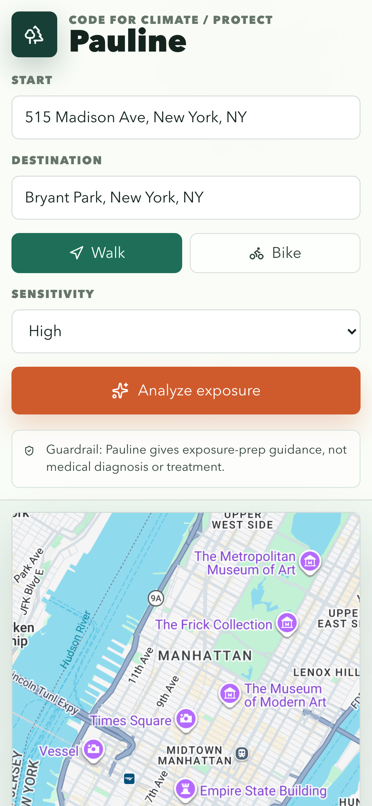
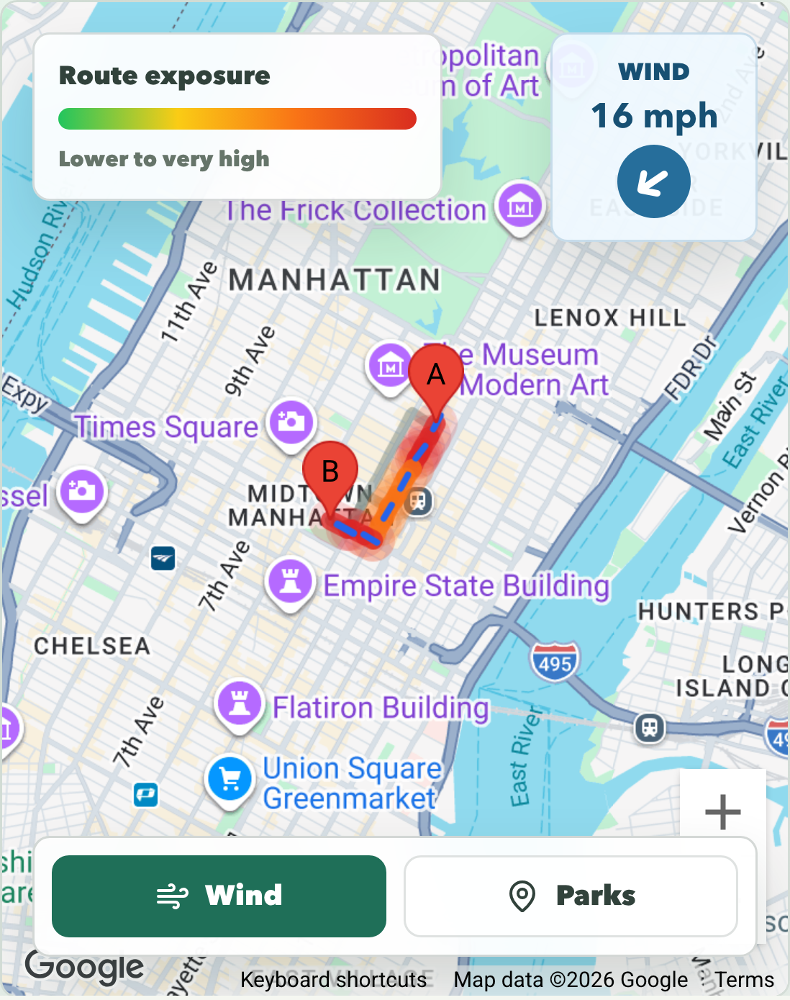
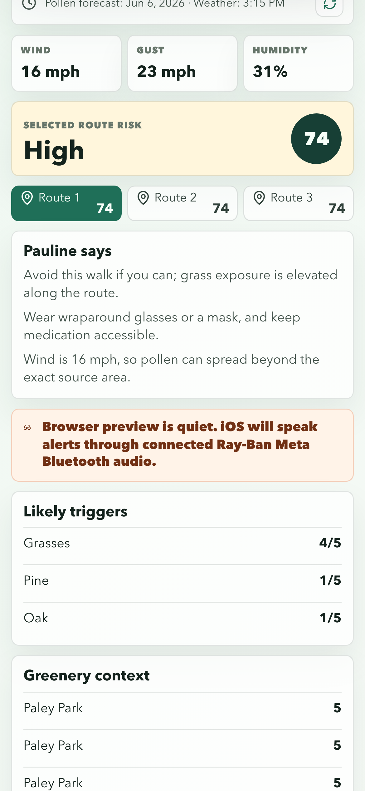
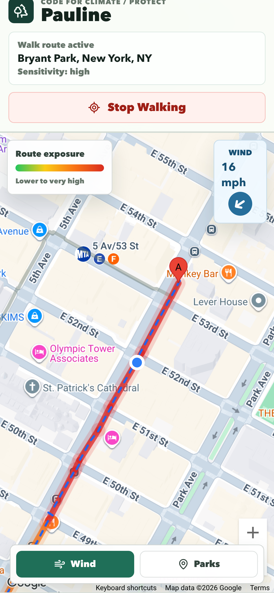

# Pollen Pal

Pollen Pal is a Code for Climate prototype for pollen-sensitive walkers and cyclists. It compares walking/biking routes and combines:

- Google Maps route alternatives
- Google Pollen API route sampling
- Open-Meteo wind, gust, humidity, and rain data
- A simple exposure score with preparation guidance

## Setup

Create `.env.local` in the project root:

```bash
VITE_GOOGLE_MAPS_API_KEY=your_browser_restricted_google_maps_key
GOOGLE_POLLEN_API_KEY=your_server_side_google_pollen_key
```

The browser key should be restricted to your dev/deploy origins:

```text
http://localhost:5173/*
http://127.0.0.1:5173/*
https://your-vercel-domain.vercel.app/*
```

Enable/restrict that browser key to:

```text
Maps JavaScript API
Directions API (Legacy)
Places API / Places API (New)
```

The pollen key should not be exposed in client code. Enable/restrict it to:

```text
Pollen API
```

## Run

```bash
npm install
npm run dev
```

Open `http://localhost:5173`.

## Demo Flow

1. Enter an origin and destination.
2. Pick walking or biking.
3. Pick sensitivity.
4. Click `Analyze exposure`.
5. Show the best route, risk score, likely triggers, wind context, and iOS Bluetooth/Meta glasses audio alert path.

## Guardrail Story

Pollen Pal gives exposure-preparation guidance only. It does not diagnose allergies, prescribe medication, or replace clinician advice. The Google Pollen key is kept server-side through the local Vite proxy.

## Demo Assets

The latest iOS demo screenshots are tracked in `demo-assets/` for slides, judging, and README preview.

| Route setup | Route exposure |
| --- | --- |
|  |  |

| Route risk panel | Walking / navigation mode |
| --- | --- |
|  |  |

| Glasses alert |
| --- |
|  |
